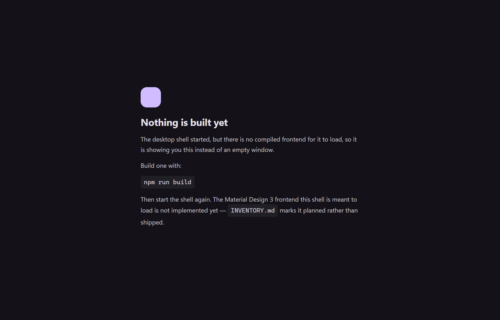

<div align="center">


# Material Open WebUI

**A Material Design 3 rewrite of [Open WebUI](https://github.com/open-webui/open-webui) as a self-contained Electron desktop app for Windows.**

Frameless Material 3 chrome · browser-style tabs · a local Ollama suite manager,
file converter and authenticator · bilingual English and Cantonese · fully
offline · nothing in it is ever for sale.

[**Documentation site →**](https://ding-ding-projects.github.io/material-openweb-ui/)

</div>

---

> [!IMPORTANT]
> **No installer has been published, and the desktop application is not built yet.**
> What exists today is the design and the documentation site. Every feature below
> is marked with what is actually shipped and what is planned, and
> [`INVENTORY.md`](INVENTORY.md) is checked by a guard on every build so those
> claims cannot quietly drift away from the code.

## Install

There is nothing to install yet. When there is, it will be an **unsigned** Windows
installer — the operating system will warn you about it, and that warning will be
telling the truth. This project does not sign releases, ever, and says so before
the download rather than after.

In the meantime:

```bash
git clone https://github.com/Ding-Ding-Projects/material-openweb-ui
cd material-openweb-ui
build.bat
```

`build.bat` assumes a machine with nothing installed. It obtains its own
toolchain — including a Node version inside this project's supported range, since
upstream pins `<=22.x.x` with `engine-strict` on — installs dependencies, runs the
gates, and then asks whether to run what it built. `build.bat /s` does the same
with no prompts and a non-zero exit on the first real failure.

## Contents

[What this is](#what-this-is) ·
[Status](#status) ·
[Screenshots](#screenshots) ·
[Features](#features) ·
[Repository layout](#repository-layout) ·
[Development](#development) ·
[Working agreement](#working-agreement) ·
[Licence and attribution](#licence-and-attribution)

---

## What this is

Open WebUI does the hard work underneath: the model plumbing, the backend, the
years of it. This fork changes the interface and adds a desktop shell around it,
and it changes nothing about who deserves the credit. Upstream's own README is
preserved verbatim at [`README.upstream.md`](README.upstream.md).

The rewrite has three commitments that shape everything else.

**It runs where you are sitting.** Chats, settings, one-time codes and converted
files stay in the application on the machine you used. There is no account to
make, and nothing you have to switch off to keep it that way.

**Nothing on screen is decoration.** If it looks like a control, it works. A
button that cannot do its job names the condition that is unmet. An empty state
stays honestly empty instead of being filled with sample data. A screenshot slot
with no screenshot says so, rather than showing a mockup wearing one's clothes.

**Voice is adjustable; facts are not.** Three language modes and a funny-level
slider per language, from fully serious to maximum playfulness. At every level
the message still names what happened, what is affected, and what your options
are. A warning nobody can act on is a broken warning, not a funny one.

## Status

<details>
<summary><b>Where each surface actually is</b> — one live, one designed, one not started</summary>

<br>

| Surface | State |
| --- | --- |
| **Documentation site** | **Live** at [ding-ding-projects.github.io/material-openweb-ui](https://ding-ding-projects.github.io/material-openweb-ui/). Six tabbed destinations, a command palette, regex builders, three language modes, both themes, append-only local history, export. |
| **Design** | Landing page designed against the application's own token sheet — desktop, bilingual and phone views. Sources in [`design/landing/`](design/landing/). |
| **Desktop application** | **Not started.** The Material 3 prototype it will be built from is vendored verbatim in [`design/`](design/). |
| **Installer** | **None.** No release has been published. |

The prototype in `design/` is not a mockup: its one-time codes are real, its file
converter really converts, and its settings really persist. What it simulates is
the Ollama runtime and the window controls, both named as explicit swap points in
its own handoff document.

</details>

## Screenshots

<details open>
<summary><b>Captures</b> — one real one, and an honest gap where the rest go</summary>

<br>

**The desktop shell, running.** Frameless, on the Material 3 dark surface token,
with no compiled frontend present — so it says exactly that and names the command
that would produce one, rather than opening an empty white rectangle.



That is a real capture of the real executable at commit `6173dc348`, taken on an
off-screen desktop so the machine's visible session was never disturbed. Every
capture in [`docs/assets/captures/`](docs/assets/captures/) records the commit it
was taken at.

**What is missing:** the Material Design 3 application interface, because it is
not implemented yet. That gap is left visible rather than filled with a
screenshot of the prototype, which would show something that has never run as
this product. The documentation site is live and can be looked at directly in the
meantime.

</details>

## Features

<details>
<summary><b>The full list</b> — 36 features, with what is shipped and what is not</summary>

<br>

The complete catalogue with per-surface status is on the documentation site, and
every feature has its own article covering behaviour, failure modes and how to
verify it. The short version:

**Interface and navigation** — Material 3 throughout; a frameless window with a
custom title bar; browser-style tabs that dock to any edge with pinning, grouping
and an overflow surface; four tab-discovery searches; and a command palette on
`Ctrl+Shift+F` whose rows are live controls and which teleports to the exact
element rather than the general area.

**Search** — a regex builder anchored beside every search field, every dropdown
filter and every right-click menu filter. Plain text stays the default and regex
is an explicit opt-in.

**Models** — a local Ollama suite manager speaking only the documented local HTTP
API, with an exhaustive catalogue rather than a curated shortlist, and hardware
fit verdicts computed from measured RAM, VRAM and free disk rather than guessed
from a model name.

**Tools** — a file converter that detects type from actual bytes across eight
adapter categories and lists unavailable formats with the exact missing
dependency; and a standards-correct authenticator checked against the RFC 6238
published test vectors, with QR pairing drawn in-process and never by a remote
service.

**Locks** — per-element password or one-time-code locks, each with its own
independent credential, plus a support-desk recovery route and an unlock ladder
that clears the waiting and never the credential.

**Language** — three modes, two funny-level sliders, an emoji toggle, a
personal-vocabulary upload validated in full before anything is displayed, and a
narrator with a separate voice picker per narrated language.

**Safety and data** — a two-key-plus-slider gate on every destructive action;
non-blocking notifications with a reviewable centre; bulk actions on every list;
export in every format that can carry the data; append-only local history; and a
changelog viewer where every entry links to the commit that made the change.

</details>

## Repository layout

<details>
<summary><b>What lives where</b></summary>

<br>

| Path | What it is |
| --- | --- |
| `docs/` | The documentation site, published to GitHub Pages. Vanilla ES modules, no build step, and no third-party request of any kind. |
| `docs/assets/fonts/` | Vendored Roboto Flex and Roboto Mono, latin subsets, 208 KB. Chinese uses the reader's platform face rather than shipping megabytes of CJK. |
| `design/` | The Material 3 prototype, verbatim from the design tool. Reference only — never built, never linted, never edited in place. |
| `design/landing/` | The landing-page design sources. |
| `src/`, `backend/` | Upstream Open WebUI, unmodified so far. |
| `scripts/` | The completeness guard, its negative regression, and the line counter CI runs at release. |
| `INVENTORY.md` | The hand-written completeness inventory the guard checks the tree against. |
| `AGENTS.md` | The full working agreement. |
| `README.upstream.md` | Upstream Open WebUI's own README, preserved unchanged. |

</details>

## Development

<details>
<summary><b>Running and checking it</b></summary>

<br>

The documentation site is static and needs no build:

```bash
npx http-server docs -p 8080 -c-1
```

The gates, which `build.bat` also runs:

```bash
node scripts/check-inventory.mjs
node scripts/test-inventory-guard.mjs
node scripts/count-lines.mjs
```

`check-inventory.mjs` fails when the tree and `INVENTORY.md` disagree in either
direction — a catalogued feature with no row, a row for a feature that no longer
exists, a shipped claim whose anchor does not resolve, a planned row that quietly
grew one, or a status the site renders that the inventory does not back up.

`test-inventory-guard.mjs` is the reason to trust any of that. It removes one
asserted item at a time from a scratch copy and requires the guard to turn red
for each, then requires green again once restored. On its first run it found a
real hole: renaming `searchField` to `searchFieldRenamed` left the guard green,
because a substring check still matched the old needle inside the new name. That
is exactly the failure a completeness guard is supposed to be immune to, and it
was sitting in the guard itself.

</details>

## Working agreement

<details>
<summary><b>The rules this project is built under</b> — summary; full text in AGENTS.md</summary>

<br>

[`AGENTS.md`](AGENTS.md) carries the complete, sanitized working agreement.
Anyone working in this repository, human or agent, is expected to follow it. The
parts that shape the code most:

- **Every rule applies to every surface** — the app, the site, the landing page,
  every settings screen, every dialog, individually. "It is only docs" is not an
  exemption. Where a rule genuinely cannot apply, say which rule and why rather
  than leaving a silent gap that reads as an oversight to the next person and as
  a decision to nobody.
- **Feature delivery is fail-closed**, tracked by a hand-written inventory and a
  guard that has been watched fail. A checklist that discovers its own items can
  never notice that an item disappeared.
- **Never present unreleased work as shipped.** Status is stated per surface, and
  "planned" is written where it is true.
- **Plain text is the default search mode, and a regex builder is anchored beside
  every field** — including every dropdown and every right-click menu. Four items
  is not an exemption, because a four-item menu becomes fourteen without anyone
  revisiting the decision.
- **Destructive actions need two independent keys and a slider**, and name the
  exact data affected at every language and funny level.
- **Credentials never enter settings files, exports, logs, screenshots or version
  control**, and a toy lock never claims to secure anything.
- **No CDN, no remote font, no remote image, no analytics** on any surface.
- **Accessibility and clipping defects are completion blockers**, not polish.
- **Commits are bilingual**, carry one author, and say what actually changed.
- **Nobody ever pays anything**, and there are no prompts asking them to.

</details>

## Licence and attribution

<details>
<summary><b>Upstream, licence, and why the branding stays</b></summary>

<br>

This repository is a fork of [**Open WebUI**](https://github.com/open-webui/open-webui)
by Open WebUI Inc., created by Timothy Jaeryang Baek. The upstream project is the
substance underneath this one, and its README is preserved at
[`README.upstream.md`](README.upstream.md).

The code is governed by multiple licences depending on when it was contributed —
see [`LICENSE`](LICENSE), [`LICENSE_HISTORY`](LICENSE_HISTORY) and
[`LICENSE_NOTICE`](LICENSE_NOTICE). Clause 4 of the Open WebUI License restricts
altering or removing "Open WebUI" branding above a threshold of fifty end users in
any rolling thirty-day period. A single-user desktop application sits inside that
exemption, and this project keeps the upstream name and attribution regardless,
because the interface is what changed and the credit is not.

Nothing here is for sale, and no funding link on this project routes anything away
from upstream.

</details>

---

<div align="center">
<sub>A Ding Ding Projects application · unsigned by policy · everything stays local</sub>
</div>
